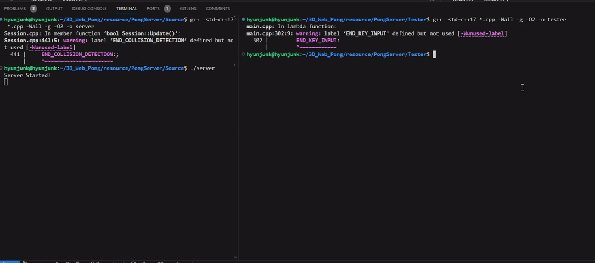
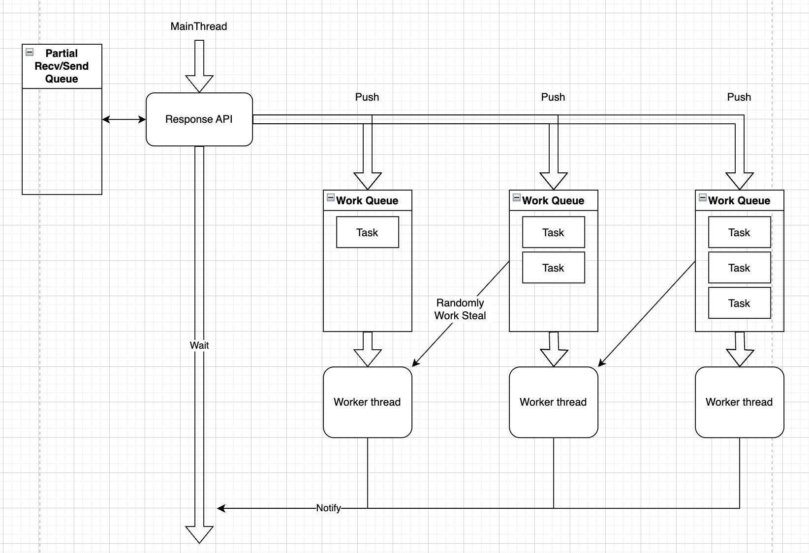

# PongServer
A simple multithread pong game server using TCP/UDP.

# Preview
  
[](https://youtu.be/hOBc6DK7bnk?t=0s)  

# Flow


## Server Build / Run
```bash
$ g++ -std=c++17 -O2 Source/*.cpp -o server
$ ./server
```

## Tester Build / Run
```bash
$ g++ -std=c++17 -O2 Tester/main_visual.cpp -o tester
$ ./tester
```


# API Documentation

## API Port
Change the content in "config.h" if you want to change.
```
Default : 9180
```

## Flow
```
┌───────────────┐       Main Thread                                                          ┌───────────────┐
│               │                                                                            │               │
│               │   ┌──────Query──────┐                                                      │               │
│               │   │                 │                                                      │               │
│               │   │  CreateSession  ├─────────────────────────────────────────────────────►│               │
│               │   │                 │                                                      │               │
│               │   └────────┬────────┘                                                      │               │
│               │            │                 Recv Thread         Input Processing Thread   │               │
│               │            ▼                                                               │               │
│               │   ┌──────Query──────┐            ─┬─                       ─┬─             │               │
│               │   │                 │             │                         │              │               │
│               │   │   BeginRound    ├─────────────┼─────────────────────────┼─────────────►│               │
│               │   │                 │             │                         │              │               │
│               │   └────────┬────────┘             │                         │              │               │
│               │            │                      │                         │              │               │
│               │            │                      │                         │              │               │
│               │            │              ┌───────┴────────┐                │              │               │
│               │            │              │                │                │              │               │
│               │◄───────────┼──────────────┤  Relay state   │◄───────────────┼──────────────┤               │
│               │            │              │                │                │              │               │
│               │            │              └────────────────┘                │              │               │
│               │            │              ┌────────────────┐                │              │               │
│    Players    │            │              │                │                │              │  Game Server  │
│               │◄───────────┼──────────────┤  Relay state   │◄───────────────┼──────────────┤               │
│               │            │              │                │                │              │               │
│               │            │              └────────┬───────┘                │              │               │
│               │            │                       │                        │              │               │
│               │            │                       │                        │              │               │
│               │            │                       │              ┌───────Query───────┐    │               │
│               │            │                       │              │                   │    │               │
│               ├────────────┼───────────────────────┼─────────────►│ ActionPlayerInput ├───►│               │
│               │            │                       │              │                   │    │               │
│               │            │                       │              └─────────┬─────────┘    │               │
│               │            │                       │                        │              │               │
│               │            │              ┌────────┴───────┐                │              │               │
│               │            │              │                │                │              │               │
│               │◄───────────┼──────────────┤  Relay state   │◄───────────────┼──────────────┤               │
│               │            │              │                │                │              │               │
│               │            │              └────────┬───────┘                │              │               │
│               │            │                       │                        │              │               │
│               │   ┌────────┴────────┐              │                        │              │               │
│               │   │                 │              │                        │              │               │
│               │   │ Result Returned │◄─────────────┼────────────────────────┼──────────────┤               │
│               │   │                 │              ▼                        ▼              │               │
│               │   └────────┬────────┘                                                      │               │
│               │            │                                                               │               │
│               │            │                                                               │               │
└───────────────┘            ▼                                                               └───────────────┘
```

## API Query Header
|Name|Type|Byte|Description|
|:---|:---:|:---:|:---|
|QueryID|uint32_t|4|Query ID|

## API Response Header
|Name|Type|Byte|Description|
|:---|:---:|:---:|:---|
|QueryID|uint32_t|4|Query ID you sent|

## API Query Example
```cpp
struct CreateSession_Param
{
    uint32_t QueryID = 101;
    uint32_t FieldWidth = 800;
    uint32_t FieldHeight = 400;
    uint32_t WinScore = 10;
    uint32_t GameTime = 300;
    float BallSpeed = 1.0f;
    float PaddleSpeed = 1.0f;
    uint16_t UdpPort_Recv_Stream = 9981;
} param;
send(socket, &param, sizeof(param), 0);

struct __attribute__((packed)) CreateSession_Response
{
    uint32_t QueryID;
    uint8_t Result;
    //< There should never exist padding bytes between fields
    uint32_t SessionID;
} response;
recv(socket, &response, sizeof(response), 0);

if (response.QueryID == 101)
{
    if (response.Result == 0)
    {
        // Success
        std::cout << "SessionID: " << response.SessionID << std::endl;
    }
    else
    {
        // Fail
    }
}
```

# API Query List
- [API Query List](#api-query-list)
  - [CreateSession\_v1](#createsession_v1)
  - [BeginRound\_v1](#beginround_v1)
  - [ActionPlayerInput\_v1](#actionplayerinput_v1)
  - [AbortSession\_v1](#abortsession_v1)

## CreateSession_v1
Request to create a new game session.
- ### QueryID
    `101`
- ### Parameter
    |Name|Type|Byte|Description|
    |:---|:---:|:---:|:---|
    |FieldWidth|uint32_t|4|The width of the field.|
    |FieldHeight|uint32_t|4|The height of the field|
    |WinScore |uint32_t|4|The point at which the game ends with a win if reached|
    |GameTime |uint32_t|4|The time at which the game ends with a win if reached(sec)|
    |BallSpeed|uint32_t|4|The speed of the ball. (Move distance per second)|
    |BallRadius|uint32_t|4|The radius of the ball.|
    |PaddleSpeed|uint32_t|4|The speed of the paddle.|
    |PaddleSize|uint32_t|4|The size of the paddle.|
    |PaddleOffsetFromWall|uint32_t|4|The distance between the paddle and the wall.|
    |RecvUdpPort_ObjectPos_Stream|uint16_t|2|The port number to receive for the position of all objects.<br> Start sending after calling BeginRound query. (See [BeginRound_v1](BeginRound_v1))|
- ### Response
    |Name|Type|Byte|Description|
    |:---|:---:|:---:|:---|
    |Result|uint8_t|1|The result of the request <br> - 0: Success<br> - 1: Fail|
    - **If Result == success**  
        |Name|Type|Byte|Description|
        |:---|:---:|:---:|:---|
        |SessionID|uint32_t|4|Unique session ID|

## BeginRound_v1
Start a new round.
- ### QueryID
    `201`
- ### Parameter
    |Name|Type|Byte|Description|
    |:---|:---:|:---:|:---|
    |SessionID|uint32_t|4|Unique session ID|
- ### Response
    |Name|Type|Byte|Description|
    |:---|:---:|:---:|:---|
    |Result|uint8_t|1|The result of the request <br> - 0: Success<br> - 1: Fail|
    - **If Result == success**  
        This response is returned after the round is over.
        |Name|Type|Byte|Description|
        |:---|:---:|:---:|:---|
        |WinPlayer|uint32_t|4|The player who won the game <br> - 0: Draw (Timeover)<br> - 1: Player A<br> - 2: Player B|
        
- ### [UDP] ObjectPos Packet
    Start sending immediately after a successful BeginRound_v1.  
    |Name|Type|Byte|Description|
    |:---|:---:|:---:|:---|
    |BallPos|float[2]|8|The position of the ball|
    |PlayerA_PaddlePos|float|4|The position of the paddle of player A|
    |PlayerB_PaddlePos|float|4|The position of the paddle of player B|

    - Field & Ball Coordinate
        ```
                    PlayerA                      PlayerB 
                                                        
        FieldHeight ▲   ┌──────────────┬──────────────┐    
                    │   │              │              │    
                    │   │              │              │    
                    │   │ │            │ ┌─┐        │ │    
                    │   │ │            │ └─┘        │ │    
                    │   │ │            │            │ │    
                    │   │              │              │    
                    │   │              │              │    
                  0 │   └──────────────┴──────────────┘    
                                                        
                        ──────────────────────────────►    
                        0                        FieldWidth
        ```

    - Relative Paddle Coordinate
        ```
                ┌───────────────────┐            
                │                   │            
                │                   │            
                │                   │            
                │                   │            
                │                   │            
                │                   │            
                │                   │            
                │                   │            
                │                   │            
                │                   │            
                │     ┌───────┐     │            
                │     └───────┘  ◄──┼───── Paddle
                │                   │            
                └───────────────────┘            
                                                
                ──────────|────────►            
         -FieldHeight/2   0   +FieldHeight/2
        ```

## ActionPlayerInput_v1
Send the input of the player.
- ### QueryID
    `301`
- ### Parameter
    |Name|Type|Byte|Description|
    |:---|:---:|:---:|:---|
    |SessionID|uint32_t|4|Unique session ID|
    |PlayerID|uint32_t|4|The ID of the player who sends the input <br> - 1: Player A<br> - 2: Player B|
    |InputKey|uint8_t|1|The input key of the player <br> - 0: None<br> - 1: Left<br> - 2: Right|
    |InputType|uint8_t|1|The input type of the player <br> - 0: None<br> - 1: Press<br> - 2: Release|
- ### Response
    No response

## AbortSession_v1
Abort a specific session.
- ### QueryID
    `102`
- ### Parameter
    |Name|Type|Byte|Description|
    |:---|:---:|:---:|:---|
    |SessionID|uint32_t|4|Unique session ID|
- ### Response
    |Name|Type|Byte|Description|
    |:---|:---:|:---:|:---|
    |Result|uint8_t|1|The result of the request <br> - 0: Success<br> - 1: Fail|